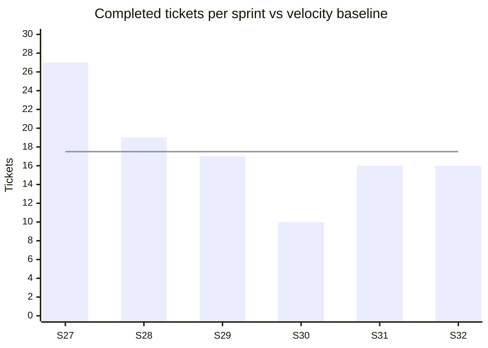

# Telemax — Sprint 30–32 progress report
_24 Aug → 4 Oct 2026 · Australia/Melbourne · generated 7 Oct 2026 · Sprint 33 (5–18 Oct) forecast_

> **DRAFT FOR REVIEW.** Lines marked `[PM: …]` still need your input. They will be filled in or removed before the report is sent.

## TL;DR
- **Status: On track, with one item to watch.** 42 tickets were completed across Sprints 30–32 (10 / 16 / 16). Four big items were completed: Night Driving Alert, the PostgreSQL 15 upgrade on staging, Road detection and the September production issues. The production database stays on its current version until the system is stable; that upgrade is planned to start in 2027.
- **Azure cost:** down from A$9,128 (August, before optimisation) to an estimated ≈ A$5,500 a month after removing unused resources and reducing logs. That is about 40% lower, a saving of roughly A$3,600 a month.
- **Watch:** velocity (10 / 16 / 16) is below the ~20 forecast and the 17.5 baseline; the OOM goal passed its 2 Oct due date at 20%; Sprint 33 holds 79 tickets. `[PM: reasons + OOM ETA]`
- **Needed from you:** `[PM: decisions / support needed, or "nothing needed"]`

## Summary

Completed tickets per sprint, counted the way the sprint dashboard counts them: top-level tickets only (no subtasks), **completed = status Closed**. Totals and completion rates are not shown: unfinished tickets move to the next sprint list and keep no record of the sprint they left, so a closed sprint's total cannot be rebuilt.

| | Sprint 30 (24 Aug–6 Sep) | Sprint 31 (7–20 Sep) | Sprint 32 (21 Sep–4 Oct) | Sprint 33 (forecast) |
|---|---|---|---|---|
| Completed (Closed) | 10 | 16 | 16 | **10–16** expected · 1 Closed so far (+18 released / ready for release, not yet Closed) |
| Dev done (awaiting release) | — | — | — | 13 so far |
| Production bugs raised ¹ | 1 | 1 | 3 | 0 so far |
| Production bugs resolved ¹ | 2 | 0 | 3 | 3 so far (2 by workaround) |

_¹ Production bugs = tickets of type **BUG_PRODUCTION** (all top-level). Raised = created in the sprint, cancelled ones excluded (S32 had one more, [Location insights inspection](https://app.clickup.com/t/14ym01uf2pt), cancelled the next day). Resolved = closed in the sprint: S30 [password setup](https://app.clickup.com/t/86d3xgdf8) and [live-map sidebar search](https://app.clickup.com/t/86d42bp1t); S32 ["Map not loading" #24662](https://app.clickup.com/t/86d45fmmu), [Trip report 10× distance](https://app.clickup.com/t/14ym01ucfn7) and [fleet reporting percentage](https://app.clickup.com/t/86d411efk) (the first two closed on 21 Sep, the first day of S32, so S31 shows 0); S33 [webhook docs casing](https://app.clickup.com/t/14ym01uhr2w) (deployed to prod, no close date yet). Handled with a workaround and still monitored: [Nav Rentals #24836](https://app.clickup.com/t/14ym01uhd01) and [Live map not showing vehicles #24843](https://app.clickup.com/t/14ym01uhrak) (S33)._

Throughput rose from 10 to 16 tickets per sprint and then held at 16, below the S27–S32 baseline of 17.5.

_Bars: completed tickets per sprint. Line: velocity baseline = mean completed S27–S32 = **17.5 tickets per sprint**. S27–S29 figures are from the previous report (sprint dashboard)._

**Forecast vs actual:** the previous report expected ~20 completed per sprint from Sprint 30 (≈ 4–6 per member). Actual: 10, 16 and 16 — below forecast in all three sprints, and below the 17.5 baseline. `[PM: reason — e.g. sprint scope, ticket size, team changes]`

## Goals

Dev done = deployed to staging, awaiting verification and release.

| Goal | Status | Done | Dev done | Open | % done | % incl. dev done | Due |
|---|---|---|---|---|---|---|---|
| OOM issue in current system | In review · **overdue** | 2 | 1 | 7 | 20% | 30% | 2 Oct |
| Dashboard UI revamp | In progress | 0 | 1 | 1 | 0% | 50% | 21 Oct |
| Customer feedbacks October | In progress | 1 | 0 | 2 | 33% | 33% | — |
| MCP for Telemax (external use) | In progress | 0 | 0 | 1 | 0% | 0% | — |
| Finish turning off old site | ✅ Done | 5 | 0 | 0 | 100% | 100% | — |
| Finish Night Driving Alert | ✅ Done | 13 | 0 | 0 | 100% | 100% | 25 Sep |
| PostgreSQL 15 upgrade (staging) | ✅ Done on staging ² | 3 | 0 | 0 | 100% | 100% | 18 Sep |
| Road detection | ✅ Done ¹ | 15 | 1 | 0 | 94% | 100% | — |
| PRD issues September | ✅ Done | 3 | 0 | 0 | 100% | 100% | — |

Counts = tickets linked to each goal, cancelled excluded.

¹ Live in production; one follow-up fix on staging.

² Staging only; production upgrade planned for 2027.

### Goals across sprints

`[PM: to be filled in]`

### Before goals — big items completed in Sprints 30–32

Goals were introduced in September; before that, big items were tracked as tickets with subtasks. Big items closed in Sprints 30–32:

| Sprint | Big item |
|---|---|
| S30 | [Report schedules — test & fixes](https://app.clickup.com/t/86d443av4) |
| S30 | [Vehicle Card on the live map](https://app.clickup.com/t/86d40w5np) |
| S30 | [Vehicle page v1](https://app.clickup.com/t/86d3zkynn) |
| S30 | [SMS commands via Flespi](https://app.clickup.com/t/86d3qhj3r) |
| S31 | [Day-of-week report filter](https://app.clickup.com/t/86d446kj4) |
| S32 | [Deactivated companies & account status](https://app.clickup.com/t/86d3w2539) |
| S32 | [Device onboarding automated](https://app.clickup.com/t/86d3cc1gm) |
| S32 | [Per-company feature switches](https://app.clickup.com/t/14ym01udp18) |
| S32 | [RBC Group report defects](https://app.clickup.com/t/86d446e6m) |

**Other goals**

| Goal | Status |
|---|---|
| Customer portal | In progress |
| Check site security — penetration testing & fixes | To do |
| Connected car: automate device onboarding | On hold |
| [PRD upgrade to PostgreSQL 18](https://app.clickup.com/t/14ym01udwjt) | Deferred to 2027 |
| [.NET Core migration to the next LTS version](https://app.clickup.com/t/14ym01uk02z) | **New** · Ready to pick up |
| [Clean up unused services](https://app.clickup.com/t/14ym01ufyad) | Done (Azure resource optimisation; Jim monitoring the last old-site services) |
| ↳ [Identify and shut down unused / redundant resources](https://app.clickup.com/t/14ym01ugcny) | Done |
| Optimize the Compass IoT service costs | In progress |
| Infra: checking the costs in TimescaleDB | In progress |
| Code review — optimise costs against Cloud Thinker | In progress |
| Flespi — optimise costs by removing deactivated trackers | Ready to pick up |
| Gearbox API | In progress |
| Battery prediction | Dev done (on staging) |
| Finish Installer app verification | Dev done (on staging) |
| Finishing half-done items | In progress |
| Location insights | On hold |
| Report UI revamp | Cancelled |
| Driver leaderboard (shared with Karmo and Jucy) | On hold |
| Dirt road | To do |
| Re-evaluate Cloud Thinker (build "Telemax Thinker") | To do |
| Build a skill for ticket and design creation | Ready to pick up |
| Night driving alerts | Released |
| Finish reported issues | Done |
| Finish Info Agent in PRD | Done |

`[PM: drop any internal-only goals from this list before sending]`

## Highlights — delivered in Sprints 30–32

**Live map & vehicles**
- [Vehicle card on the live map](https://app.clickup.com/t/86d40w5np) — new vehicle card with key status at a glance; [battery icon colour simplified](https://app.clickup.com/t/86d449t8r) and [vehicle labels updated](https://app.clickup.com/t/86d445wq5) on the detail view and pop-up.
- [Vehicle page v1](https://app.clickup.com/t/86d3zkynn) released.
- [Live-map sidebar search](https://app.clickup.com/t/86d42bp1t) now also filters vehicles on the map, not only the list.
- [Connected (Tesla) vehicles](https://app.clickup.com/t/86d44y8v3) — 2-hour offline threshold, new “Asleep” state, accessible status dots.
- Vehicle edit pop-up fixes: [colour/body type now written to the activity log](https://app.clickup.com/t/86d4497xe), [consistent empty-field display](https://app.clickup.com/t/86d44826q), [odometer source locked on connected/OEM vehicles](https://app.clickup.com/t/86d44qw1c).

**Reports**
- [Phase 1 report filters](https://app.clickup.com/t/86d44pcuy) and a [day-of-week filter](https://app.clickup.com/t/86d446kj4) (show/hide weekends).
- [Daily Mileage no longer drops Mondays](https://app.clickup.com/t/86d446c8z) — the weekday was taken from UTC instead of local time, hiding Mondays for every Australian (UTC+) customer.
- [Trip Report distance fixed](https://app.clickup.com/t/14ym01ucfn7) — for one device type the report read odometer units of 0.1 km as km, so trips showed 10× the real distance (e.g. 51 km reported for a 5 km trip).
- [Report timeouts no longer shown as an outage](https://app.clickup.com/t/86d446byg) — a slow report used to display “Cannot connect to the report service API”.
- [PDF export of the Detailed Report](https://app.clickup.com/t/14ym01uc4e2) fixed; [AM/PM shown correctly](https://app.clickup.com/t/86d4487r7) on 24-hour times.
- [No empty “report generated” e-mails](https://app.clickup.com/t/14ym01uc6e6) when a scheduled report has no data.
- [RBC Group escalation closed out](https://app.clickup.com/t/86d446e6m) — the three report defects behind the churn-risk complaint (misleading timeout message, vehicle work days, Daily Mileage Mondays) are resolved.

**Alerts & devices**
- [Night Driving Alert content update](https://app.clickup.com/t/86d3udg69), and [all its calculators enabled automatically](https://app.clickup.com/t/14ym01ucfx4) when the alert is switched on.
- [SMS commands to devices via Flespi](https://app.clickup.com/t/86d3qhj3r).

**Company management**
- [Activate / deactivate companies](https://app.clickup.com/t/14ym01ubwx9) and [account-status UI for deactivated companies](https://app.clickup.com/t/86d3w2539).
- [Per-company switches for features and notification channels](https://app.clickup.com/t/14ym01udp18) (e-mail, SMS, …).

**Platform & performance**
- [PostgreSQL 15 upgrade on staging](https://app.clickup.com/t/86d3xx11q), with a [full staging scan on the new version](https://app.clickup.com/t/14ym01udwq6) (production upgrade planned from 2027); [TimescaleDB PostgreSQL upgrade](https://app.clickup.com/t/86d31ckaf).
- [Dashboard cold-start download cut from 14.5 MB to 5.4 MB](https://app.clickup.com/t/14ym01ucnpk).
- [Azure services grouped by old site / new site](https://app.clickup.com/t/14ym01ufm96).

**Old-site retirement**
- [Device onboarding automated](https://app.clickup.com/t/86d3cc1gm).
- [Legacy site and database dependencies removed](https://app.clickup.com/t/86d432u7z).
- [Confirmed no traffic still reaches the old site](https://app.clickup.com/t/14ym01udwpb).

## Azure resource optimisation

| | Monthly Azure cost (AUD) |
|---|---|
| August 2026, before any optimisation | **A$9,128** |
| Estimate after removing unused resources and reducing logs | **≈ A$5,500** |
| Saving | **≈ A$3,600 / month (about 40%)**, or roughly A$43,000 a year |

- **What was done:** unused and redundant Azure resources were removed (goal [Clean up unused services](https://app.clickup.com/t/14ym01ufyad) → [Identify & shut down unused resources](https://app.clickup.com/t/14ym01ugcny), closed 7 Oct), and log collection was reduced to cut ingestion and retention costs.
- **What is next:** the cost goals still in progress (Compass IoT, TimescaleDB, code review against Cloud Thinker, Flespi deactivated trackers) may lower the figure further.
- The A$5,500 figure is an estimate. The first full month of invoiced cost after the changes will confirm it.

**Production fixes & customer requests**
- [Warranty date](https://app.clickup.com/t/86d45py3q) now shows onboarding date + 2 years instead of the data-migration date.
- [“Map not loading” (NZ customer)](https://app.clickup.com/t/86d45fmmu) — after each deployment the live map briefly received no vehicles and showed an empty map; it now shows a loading state and recovers, and Replay no longer shows a false ongoing trip.
- [Fleet reporting percentage](https://app.clickup.com/t/86d411efk) corrected — some companies (e.g. Karmo, 35%) showed only part of their fleet as reporting.
- [New-user password setup](https://app.clickup.com/t/86d3xgdf8) — “Could not set the password” error on new accounts fixed.
- [External API intermittent HTTP 500s](https://app.clickup.com/t/86d3x39zr) — early-morning token failures traced to an unbounded database query pulling very old vehicle data; the query is now capped.
- [Connected cars showing 0 km/h at freeway speed](https://app.clickup.com/t/14ym01ue2rn) (all Teslas) fixed.
- [Karmo Tesla fleet imported](https://app.clickup.com/t/14ym01udwkc) into the Karmo account.

## Quality

| | Sprint 30 | Sprint 31 | Sprint 32 |
|---|---|---|---|
| Bugs in sprint (top-level, excl. cancelled) | 1 | 7 | 0 |
| Fixed | 1 | 7 | 0 |
| Still open | 0 | 0 | 0 |
| Escaped to production | n/a ¹ | n/a | n/a |

Every bug planned in Sprints 30–32 was fixed within its sprint. Only tickets classified as Bug in the tracker are counted. Some production fixes are typed as tasks, for example "Trip report production bugs" and "Fleet reporting data", so the bug figures are low. `[PM: keep or drop]`

¹ Production-escaped bugs are not tagged in the tracker yet.

## Risks
- **OOM goal overdue** (due 2 Oct, 20% done). `[PM: impact + mitigation]`
- **Security review backlog:** about 20 security-review tickets are open in Sprint 33, and most are unassigned. The goal "Check site security" is due 9 Oct and has not started. `[PM: confirm wording for client + plan]`
- **Sprint 33 load:** 79 active top-level tickets against a throughput of 10–16 per sprint. 1 is Closed and 18 more are released or ready for release but not yet Closed; many of those were released before the sprint started. 13 are on staging and 47 are still open. Most of the open work will carry over unless the sprint is re-scoped. `[PM: re-scope plan]`

## Asks
`[PM: decisions or support needed from Telemax — who, by when. Remove this section if none.]`

## Team focus — Sprint 33

What each developer is following right now, **grouped by goal**. Each row is a goal the developer owns, or a goal that one of their tickets belongs to. Tickets that belong to no goal are grouped under _Not in a goal_. A subtask is shown as its **parent** ticket, with its open subtasks summarised in brackets. Done or Closed items and the shared sprint deployment task are left out. As of 7 Oct 2026.

| Developer | Goal | In progress / review / staging | Not started / on hold |
|---|---|---|---|
| **Tony** | **[Dashboard UI revamp](https://app.clickup.com/t/14ym01ucgze)** (due 21 Oct) | • [Vehicle Details page](https://app.clickup.com/t/14ym01ufwc1) (staging) | — |
|  | **[Installer app verification](https://app.clickup.com/t/14ym01uch20)** (dev done) | • [Installer app PRD deployment](https://app.clickup.com/t/86d3na1x7) | — |
|  | **[Skill for ticket/design creation](https://app.clickup.com/t/14ym01uch0a)** (**overdue**, 18 Sep) | — | _no sprint ticket_ |
|  | **[Check site security](https://app.clickup.com/t/14ym01uch08)** (goal of Darius) | — | • [Security checklist](https://app.clickup.com/t/86d40h12k) |
|  | _Not in a goal_ | • [Security: JWT secret logged on token failure](https://app.clickup.com/t/14ym01ugfr3) • [Performance: N+1 / polling DB load](https://app.clickup.com/t/14ym01ugfr2) • [Data consistency Telemax–Flespi](https://app.clickup.com/t/86d3w2a35) (re-open) • [Timezone shown as text](https://app.clickup.com/t/14ym01ufbqp) (staging) • [Company listing UI](https://app.clickup.com/t/14ym01ucc11) (staging) | • [SMS: Vietnamese address encoding](https://app.clickup.com/t/14ym01ujjam) • [HTML alert legacy updates](https://app.clickup.com/t/14ym01ufbqj) (on hold) |
| **Kelvin / KhanhND** | **[Customer portal](https://app.clickup.com/t/14ym01uch04)** (due 9 Oct) | • [Portal phase 1](https://app.clickup.com/t/86d3zkt44) (staging) • [Milestone 2 — self-service](https://app.clickup.com/t/86d42wrp2) (staging) | — |
|  | **[Gearbox API](https://app.clickup.com/t/14ym01ue367)** | • [Gearbox API integration](https://app.clickup.com/t/86d3q8f2z) (review) | — |
|  | **[Optimize Compass IoT costs](https://app.clickup.com/t/14ym01ugdgd)** | • [Compass IoT live feed via flespi streams](https://app.clickup.com/t/14ym01ugd0u) (2 subtasks: in progress, review) | — |
|  | **[Flespi: remove deactivated trackers](https://app.clickup.com/t/14ym01ujp73)** | — | • [Automate removal of deactivated trackers](https://app.clickup.com/t/14ym01ujp6z) |
|  | **[Customer feedbacks October](https://app.clickup.com/t/14ym01uhr3v)** (no owner) | • [Live map not consistently showing vehicles (#24843)](https://app.clickup.com/t/14ym01uhrak) | — |
|  | **[Infra: costs in TimescaleDB](https://app.clickup.com/t/14ym01ufmab)** · **[Location insights](https://app.clickup.com/t/14ym01uf2jf)** (on hold) · [Clean up unused services](https://app.clickup.com/t/14ym01ufyad) | — | _no sprint ticket_ |
|  | _Not in a goal_ | • [Alerts phase 1 — copy, colours, QC harness](https://app.clickup.com/t/86d445gje) (12 subtasks open: 2 in progress, 4 staging, 6 to do) • [Query performance](https://app.clickup.com/t/14ym01ufm2u) (review) • [Flespi access management](https://app.clickup.com/t/86d41x153) (review) • [Data consistency Telemax–Flespi](https://app.clickup.com/t/86d3w2a35) (re-open) | • [Ops: set-password invite on Add user](https://app.clickup.com/t/14ym01udzh0) • [OOM: evaluate TimescaleDB](https://app.clickup.com/t/14ym01ue4fr) (on hold) |
| **Darius / DungVV** | **[OOM issue in current system](https://app.clickup.com/t/14ym01ucgz9)** (**overdue**, 2 Oct) | • [Scheduled report #312 OOM investigation](https://app.clickup.com/t/86d40pcf1) (review; 1 subtask to do) • [Database periodic OOM](https://app.clickup.com/t/86d40f6v1) (staging; 1 subtask in review) | • [TimescaleDB retention policies](https://app.clickup.com/t/86d45q4bn) |
|  | **[Check site security — pen test & fixes](https://app.clickup.com/t/14ym01uch08)** (due 9 Oct) | — | • [Security scan](https://app.clickup.com/t/14ym01udc5g) |
|  | **[MCP for Telemax](https://app.clickup.com/t/14ym01ucgzg)** | • [MCP feature planning](https://app.clickup.com/t/14ym01uhrz4) | — |
|  | **[Finish turning off old site](https://app.clickup.com/t/14ym01uch0y)** (goal of Jim) | • [Old-site retirement investigation](https://app.clickup.com/t/86d3nz981) (review) | — |
|  | **[Code review — optimise costs](https://app.clickup.com/t/14ym01ujp55)** (goal of David) | — | • [Code review in Azure](https://app.clickup.com/t/14ym01ujp6m) |
|  | **[Customer feedbacks October](https://app.clickup.com/t/14ym01uhr3v)** (no owner) | — | • [Nav Rentals #24836](https://app.clickup.com/t/14ym01uhd01) |
|  | **[.NET Core migration to next LTS](https://app.clickup.com/t/14ym01uk02z)** (new) · **[PostgreSQL 18 upgrade (PRD)](https://app.clickup.com/t/14ym01udwjt)** (deferred to 2027) · **[Battery prediction](https://app.clickup.com/t/14ym01uf2j8)** (dev done) · **[Dirt road](https://app.clickup.com/t/14ym01uf2j9)** · **[Infra: costs in TimescaleDB](https://app.clickup.com/t/14ym01ufmab)** · **[Connected car onboarding](https://app.clickup.com/t/14ym01uch0d)** (on hold, due 21 Oct) · [Clean up unused services](https://app.clickup.com/t/14ym01ufyad) | — | _no sprint ticket_ |
|  | _Not in a goal_ | • [Reminder service fixes](https://app.clickup.com/t/14ym01ufgwy) (7 subtasks open: 5 staging, 2 re-open) • [Tell users the data retention limit](https://app.clickup.com/t/86d449m8k) • [SnapshotService: reload changed vehicles only](https://app.clickup.com/t/14ym01uhcm7) (staging) • [Notification permissions matrix](https://app.clickup.com/t/14ym01uh62p) (staging) | • [Reports: vehicle box blank after switching company](https://app.clickup.com/t/14ym01ujnmj) • [RBC follow-up (PRD)](https://app.clickup.com/t/14ym01uc93q) • [Confirm retention, then backfill](https://app.clickup.com/t/86d447a4c) (on hold) • [Alerts phase 2](https://app.clickup.com/t/86d445gpa) (on hold) |
| **David Dany** | **[Customer portal](https://app.clickup.com/t/14ym01uch04)** (due 9 Oct) | • [Portal phase 1](https://app.clickup.com/t/86d3zkt44) (staging) • [Milestone 2 — self-service](https://app.clickup.com/t/86d42wrp2) (staging) | • [Milestone 3 & 4 — SIM automation & billing](https://app.clickup.com/t/86d42wup0) |
|  | **[Code review — optimise costs against Cloud Thinker](https://app.clickup.com/t/14ym01ujp55)** · **[Re-evaluate Cloud Thinker](https://app.clickup.com/t/14ym01ucgzk)** | — | _no sprint ticket assigned to David_ (Code review in Azure is with Darius) |
|  | _Not in a goal_ | • [External API v2: odometer null (missing Flespi token)](https://app.clickup.com/t/14ym01ujq0p) (review) • [API v2 docs review / audit](https://app.clickup.com/t/14ym01uhrvq) (1 subtask in progress) • [Alerts phase 1](https://app.clickup.com/t/86d445gje) (1 subtask in review) • [Customer self-ordering](https://app.clickup.com/t/14ym01udx0j) (staging) • [Vehicle make/model automation](https://app.clickup.com/t/86d3w24ad) (staging) | • [Feature switches in Company detail](https://app.clickup.com/t/86d3zm255) (on hold) |
| **Jim Francinilla** | **[OOM issue in current system](https://app.clickup.com/t/14ym01ucgz9)** (**overdue**, 2 Oct) | • [Database periodic OOM](https://app.clickup.com/t/86d40f6v1) (staging) | — |
|  | **[Dashboard UI revamp](https://app.clickup.com/t/14ym01ucgze)** (due 21 Oct) | — | • [Trip Report redesign](https://app.clickup.com/t/14ym01uhdxq) |
|  | **[Finish turning off old site](https://app.clickup.com/t/14ym01uch0y)** | • [Old-site retirement investigation](https://app.clickup.com/t/86d3nz981) (2 subtasks in review: gateway cutdown, auto-redirect) • [Handle old data in the data service](https://app.clickup.com/t/86d23xxmh) ⚠️ parent cancelled, subtask Backfill processor still in progress | — |
|  | **[Clean up unused services](https://app.clickup.com/t/14ym01ufyad)** (sub-goal Identify & shut down unused resources ✅ closed 7 Oct) | — | _no sprint ticket_ |
|  | _Not in a goal_ | • [Webhook notifications not delivered in production](https://app.clickup.com/t/14ym01ugxaq) • [Align device transfer: Vehicle Edit vs Bulk Operations](https://app.clickup.com/t/14ym01ujeaz) • [Loopit external API investigation](https://app.clickup.com/t/14ym01ud6ge) • [External API V1 last-position inconsistency](https://app.clickup.com/t/86d44nmcv) • [Add new devices to accounts](https://app.clickup.com/t/86d1t08wj) (2 subtasks in review) • [GetLastPosition optimisations](https://app.clickup.com/t/86d3z8q3j) (review) • [Karmo device inventory](https://app.clickup.com/t/86d1ykhqh) (review) • [Data Service: vehicle not resolving after deletion](https://app.clickup.com/t/86d3j7m00) (review) • [Flespi device-disconnect alerts investigation](https://app.clickup.com/t/86czuhgh4) (review) • [API documentation](https://app.clickup.com/t/86d17cxyb) • [Misc – Jim](https://app.clickup.com/t/86cx7eqmf) • [Bulk operations update](https://app.clickup.com/t/86d46ac8a) (staging) • [Rename GENERIC → OEM](https://app.clickup.com/t/86d42m7qb) (staging) | • [API v1 devices not syncing (Tradiespec)](https://app.clickup.com/t/86d44fxhg) (on hold) |
| _Unassigned_ | **[Finishing half-done items](https://app.clickup.com/t/14ym01uf2j6)** · Driver leaderboard (on hold) | — | _no owner_ |
|  | _Not in a goal_ | — | • [Security: API v2 rate limits can be bypassed](https://app.clickup.com/t/14ym01uj8mm) • [Build warnings backlog](https://app.clickup.com/t/14ym01uf2pe) • ≈ 20 security-review findings (SEC-1 … SEC-8 and related) |

- **Most work sits outside goals:** about half of each developer's open tickets belong to no goal. Jim has 13 such tickets in flight, Darius 4 plus 4 not started, Kelvin the 12-subtask Alerts phase 1.
- **Goals with an owner but no sprint ticket:** .NET Core migration (new), Battery prediction, Dirt road, Connected car onboarding (due 21 Oct), Location insights, Infra costs in TimescaleDB, Clean up unused services, Re-evaluate Cloud Thinker, and the overdue skill goal.
- **Shared or misplaced work:** Darius holds tickets under Jim's old-site goal and David's code-review goal. Customer feedbacks October has tickets with Kelvin and Darius but no goal owner.
- **Security:** the site-security goal (Darius, due 9 Oct) has only two tickets, both not started. The heaviest security-review items have no owner.
- QA (MinhNT) and infra (NgaNQ) are not listed; they support items across the team.

`[PM: per-person view — keep in the client version or remove before sending]`

## Forecast — Sprint 33 (5–18 Oct)
- **Expected delivery: 10–16 tickets (≈ 14)** — range and mean of Sprints 30–32. Baseline S27–S32: 17.5.
- **Per developer:** ≈ 2.3–4.0 completed tickets per developer per sprint (mean ≈ 3.2) over Sprints 30–32, with 4 developers. Sprint 33 has 5 developers (David Dany joined), so the per-developer rate points to ≈ 12–20 developer tickets.
- Window: 3 sprints; S27–S29 come from the previous report.
- Sprint 33 holds 79 active tickets: 1 Closed, 18 released / ready for release (not yet Closed), 13 on staging and 47 open. Even if all 13 staging items are released, about 30 open tickets will likely move to Sprint 34.
- `[PM: leave / holidays / team changes in Sprint 33?]`

## Next period — Sprint 33
- **Carried over from Sprint 32:** not tracked — unfinished tickets were moved into Sprint 33 without a sprint record.
- **Goals due during Sprint 33:**
  - Customer portal and Check site security, both due 9 Oct.
  - Dashboard UI revamp and Connected car onboarding, both due 21 Oct.
- **Deferred:** the production PostgreSQL upgrade (still due 23 Oct in ClickUp) will start in 2027, once the system is stable. `[PM: update the goal date in ClickUp]`
- **New goal:** .NET Core migration to the next LTS version (Darius), ready to pick up — no tickets or dates yet.
- **Awaiting release (13 on staging):**
  - Customer portal phase 1 and milestone 2 (self-service), and customer self-ordering.
  - Vehicle Details page.
  - Company notification permissions.
  - Reminder-service fixes.
  - Database memory fix.
  - Timezone display.
  - Bulk operations.
  - Automated vehicle make/model.
- **In progress:**
  - Compass IoT live data feed.
  - Webhook delivery in production.
  - Database load and security hardening.
  - Gearbox API integration (in review).
  - MCP feature planning.

<!-- tlm-pm-metrics {"v":1,"profile":"telemax","cadence":"sprint","period":{"key":"sprint:30-32","from":"2026-08-24","to":"2026-10-04","label":"Sprint 30\u201332","firstSprint":30,"lastSprint":32},"committed":null,"completed":42,"completionRate":null,"unplanned":null,"carryOver":null,"created":null,"overdue":null,"devDone":null,"bugs":{"new":8,"fixed":8,"open":0,"escaped":null},"teamSize":4,"perMember":3.2,"hours":null,"sprints":[{"n":30,"committed":null,"completed":10,"devDone":null,"cancelled":1,"completionRate":null,"unplanned":null,"carryOver":null,"devCompleted":9,"devs":4,"perMember":2.2},{"n":31,"committed":null,"completed":16,"devDone":null,"cancelled":2,"completionRate":null,"unplanned":null,"carryOver":null,"devCompleted":16,"devs":4,"perMember":4.0},{"n":32,"committed":null,"completed":16,"devDone":null,"cancelled":3,"completionRate":null,"unplanned":null,"carryOver":null,"devCompleted":13,"devs":4,"perMember":3.2}],"forecast":{"sprint":33,"low":10,"high":16,"committed":79,"devsNext":5,"perMemberLow":2.3,"perMemberHigh":4.0},"goals":[{"id":"14ym01ucgz9","name":"OOM issue in current system","pctDone":0.2,"pctInclDevDone":0.3,"due":"2026-10-02","initialDue":null,"status":"in review"},{"id":"14ym01ucgze","name":"Dashboard UI revamp","pctDone":0,"pctInclDevDone":0.5,"due":"2026-10-21","initialDue":null,"status":"in progress"},{"id":"14ym01uch0y","name":"Finish turning off old site","pctDone":0.6,"pctInclDevDone":0.6,"due":null,"initialDue":null,"status":"in progress"},{"id":"14ym01uhr3v","name":"Customer feedbacks October","pctDone":0.33,"pctInclDevDone":0.33,"due":null,"initialDue":null,"status":"in progress"},{"id":"14ym01ucgzg","name":"MCP for Telemax for external use","pctDone":0,"pctInclDevDone":0,"due":null,"initialDue":null,"status":"in progress"},{"id":"14ym01uch0f","name":"Finish Night Driving Alert","pctDone":1,"pctInclDevDone":1,"due":"2026-09-25","initialDue":null,"status":"done"},{"id":"14ym01ucjxu","name":"PostgreSQL 15 upgrade","pctDone":1,"pctInclDevDone":1,"due":"2026-09-18","initialDue":null,"status":"done"},{"id":"14ym01ufwh1","name":"Road detection","pctDone":1,"pctInclDevDone":1,"due":null,"initialDue":null,"status":"done"},{"id":"14ym01uch1j","name":"PRD Issues September","pctDone":1,"pctInclDevDone":1,"due":null,"initialDue":null,"status":"done"}],"countBasis":"top-level tickets, completed = status type closed; totals/completion/carry-over not tracked (unfinished tickets move lists without sprint history)","baseline":{"fromSprint":27,"toSprint":32,"meanCompleted":17.5,"source":"S27-29 from previous report (PM), S30-32 from tracker"},"forecastVsActual":{"source":"previous report","expectedPerSprint":20,"actual":{"30":10,"31":16,"32":16}},"perMemberBasis":"developers only (role dev); completed tickets with >=1 dev assignee / active devs"} -->
